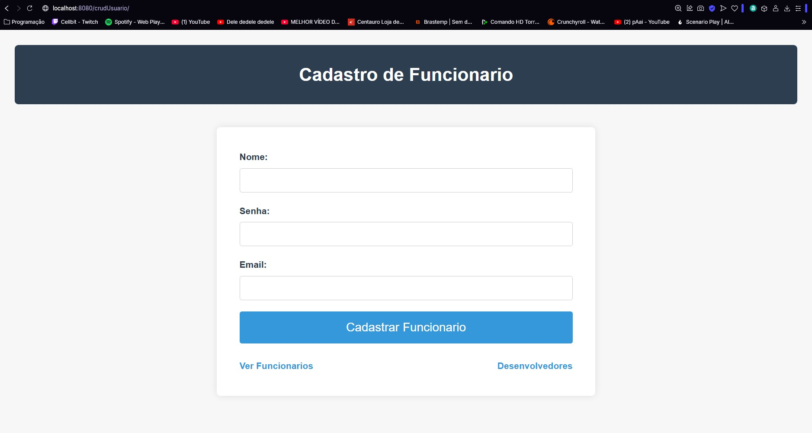

# Trabalho Prático 01 #

1. Elabore uma aplicação usando Java Servlet que realize um CRUD (create, read, update e delete) utilizando um banco de dados a sua escolha

  

 

2. Tabela utilizada no CRUD

### user *

||Column Name|Data Type|Length|Allow Nulls|
|:-:|-|-|-|:-:|
|:key:|id|int|||
||name|varchar|100|❌|
||password|varchar|100|❌|
||email|varchar|100|❌|

Clique [aqui](https://www.youtube.com/watch?v=KY4f9TZVIPg) para vizualizar a aplicação funcionando.

### Desenvolvido por Beatriz Bastos Borges e Miguel Luizatto Alves
